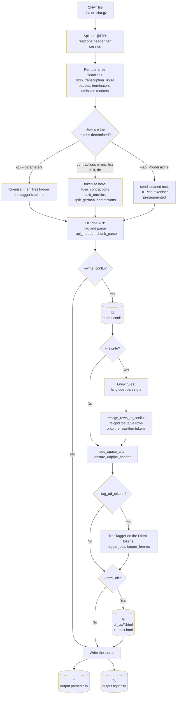

# HOWTO: processing CHILDES data

Achim Stein - updated September 2026

A step-by-step guide to converting CHILDES CHAT transcripts into word-level
tables and dependency-parsed CoNLL-U with `childes.py` and `dql.py`, developed
in project H2 of the DFG research unit
[SILPAC](https://silpac.uni-mannheim.de) (FOR 5157).

`README.md` is the reference: it lists what each script and option does. This
document is the walk-through: what to run, in which order, and what comes out.
The examples use `test-snippet.cha`, which is part of this repository. The
conversion and parsing commands run as they stand; the tagging examples need a
TreeTagger parameter file, and the Grew and `dql.py` examples need `grewpy`
(section 2).

The scripts were written for French and have since been applied to Italian,
German and English CHILDES data. Language-specific behaviour is selected from
the `@Languages` header of the CHAT file.

**Caveat**: these scripts were written by a linguist. Use them with care on your
own data, and check the output.

## 1 What the pipeline does

`childes.py` reads a CHAT file, cleans the transcription markup, decides on
tokens, sends the text to the UDPipe API for tagging and parsing, optionally
corrects the parse with Grew rules, optionally runs TreeTagger over the final
tokens for a second opinion, and writes a table with one row per token.



Two points that are easy to get wrong:

- **The tagger runs after the parse**, not before it, when `--tag_ud_tokens` is
  given. A Grew rule may split a token - Italian `della` into `di` + `la` - and
  the tagger results are consumed by word index, so tagging the pre-rewrite
  tokens would mis-tag the group and shift every `tagger_pos` and `tagger_lemma`
  after it. The columns `pos` and `lemma` hold the parser's analysis,
  `tagger_pos` and `tagger_lemma` the tagger's, and the two can be compared row
  by row.
- **Tokenisation is decided in one of three places** (section 6). Which one
  applies depends on the options and on the language.

## 2 Requirements

- Python 3.10 or later, and the packages in `requirements.txt`:
  ```sh
  pip3 install -r requirements.txt
  ```
- A network connection: parsing calls the
  [UDPipe API at Lindat](https://lindat.mff.cuni.cz/services/udpipe/).
- **`grewpy` and the Grew backend** for `--rewrite` and for `dql.py`, see
  [grew.fr/usage/python](https://grew.fr/usage/python/). It is in
  `requirements.txt`, but the backend is a separate OCaml component and needs
  its own installation step. Without it, `childes.py` still converts and parses -
  it prints a warning and skips the rewrite - while `dql.py` does not run at
  all.
- **Optional, for POS tagging**: the `tree-tagger` binary in `./tagger` and a
  parameter file, from the
  [TreeTagger site](https://www.cis.uni-muenchen.de/~schmid/tools/TreeTagger).
  For French we use `perceo-spoken-french-utf.par`, trained on spoken French.

## 3 Preparing the data

CHAT files begin with a header whose lines start with `@`:

```
@UTF8
@PID:	11312/c-00028167-1
@Begin
@Languages:	fra
@Participants:	CHI Marie Target_Child , MOT Mother , FAT Father
@ID:	fra|Geneva|CHI|2;06.10||||Target_Child|||
```

`childes.py` reads the header for the metadata of the recording and adds it to
every output row. `@Languages` selects the language-specific rules, and `@PID`
identifies the session. Utterance lines follow:

```
*CHI:	oui tetE@u là .
*FAT:	oui (.) c'est là .
%mor:	co|oui pro:dem|ce~cop|être&PRES&3S adv|là .
```

Several files can be concatenated; each header starts a new session, and the
utterance counter restarts with it:

```sh
cat *.cha > childes-all.cha
```

Gzipped input (`.cha.gz`) is read directly, so there is no need to unpack a
corpus.

## 4 Quick start: the wrapper script

`childes-pipeline.sh` runs both steps with one command. The language is selected
with `-l`, or inferred from the name of the current directory:

```sh
./childes-pipeline.sh -l french test-snippet.cha
```

Before the first run, adapt the configuration block at the top: `PYPATH` (this
repository), `DATAPATH` (where the TreeTagger parameter files are), `SERVER_IP`
(for the HTML links), and the per-language profiles below it.

```sh
./childes-pipeline.sh -1 <file>    # only step 1, childes.py
./childes-pipeline.sh -2 <file>    # only step 2, dql.py
./childes-pipeline.sh -n <file>    # print the commands, run nothing
```

For a whole corpus:

```sh
cd chat-german
for f in *.cha.gz; do bash ../childes-pipeline.sh -z "$f"; done
grep '\[FAIL\] aborted' childes-pipeline.log      # what went wrong
grep '\[WARN\]'         childes-pipeline.log      # completed, but odd
```

Every run appends one `[BEGIN]` line and one closing line to
`childes-pipeline.log`, and the script checks its own outputs afterwards - the
CoNLL-U sentence count, the presence of the provenance header, whether the light
table came out empty - so a failure inside a loop cannot pass unnoticed.

The rest of this document describes the underlying commands, in case you want to
run them yourself or adapt the script.

## 5 Running `childes.py` directly

### 5.1 Without external tools

```sh
python3 childes.py test-snippet.cha
```

Reads the CHAT file, uses the morphological annotation of the `%mor` lines, and
writes `test-snippet.csv`: one row per token, metadata repeated on every row.

```
utt_id         utt_nr  w_nr  speaker  child_project  language  child_other  age      age_days  word  utterance
28167_u1_w1    1       1     CHI      Marie_Gen      fra       C            2;06.10  922       oui   oui tetE@u là .
28167_u1_w2    1       2     CHI      Marie_Gen      fra       C            2;06.10  922       tetE  oui tetE@u là .
28167_u1_w3    1       3     CHI      Marie_Gen      fra       C            2;06.10  922       là    oui tetE@u là .
```

Given the inconsistencies in `%mor` across projects, tagging or parsing the data
yourself gives more consistent results.

### 5.2 Parsing

```sh
python3 childes.py test-snippet.cha \
    --api_model french \
    --write_conllu \
    --pos_utterance '^(VERB|AUX)' \
    --pos_output '^(VERB|AUX|NOUN|ADJ)'
```

Writes:

| file | content |
|---|---|
| `test-snippet.parsed.csv` | the full table, one row per token, with the CoNLL-U columns |
| `test-snippet.light.csv` | only the rows whose POS matches `--pos_output`, and without the CoNLL-U columns |
| `test-snippet.conllu` | the parsed corpus |

On this snippet that is 94 rows in the full table and 24 in the light one -
12 VERB, 5 ADJ, 4 AUX, 3 NOUN.

`--pos_utterance` and `--pos_output` match the **parser's UPOS** (`VERB`, `AUX`,
`NOUN`, ...) whenever `--api_model` is used. Pass `--use_tagger_pos` to match the
tagger's own tags (`VER:pres`, `VVFIN`, `VBZ`) instead. This is a frequent source
of silently empty light tables: a regex written for one tagset matches nothing in
the other.

The model name is passed to the API; see the
[UDPipe model list](https://lindat.mff.cuni.cz/repository/items/41f05304-629f-4313-b9cf-9eeb0a2ca7c6).
`--chunk_parse` sets how many utterances go into one API call; reduce it if the
API times out on a large corpus.

### 5.3 Parsing and tagging

```sh
python3 childes.py test-snippet.cha \
    --api_model french \
    -p perceo-spoken-french-utf.par --tag_ud_tokens \
    --write_conllu \
    --pos_utterance '^(VERB|AUX)' --pos_output '^(VERB|AUX)'
```

With `--tag_ud_tokens` the tagger runs **after** the parse, over the final
tokens, and fills the additional columns `tagger_pos` and `tagger_lemma`. `pos`
and `lemma` stay the parser's.

Without `--tag_ud_tokens`, `-p` reverses the order: the tagger tokenises first
and the parser is given those tokens. That is the older behaviour, and it means
the tagger's tokenisation - not UD's - decides the token boundaries.

The lexical lemmas of a tagger are often better than a parser's, because the
tagger consults a lexicon and the parser does not: for an out-of-vocabulary form
the parser invents a lemma (`metti` gives `metto`, `weißt` gives `weißen`).
Keeping both columns makes the disagreements countable.

### 5.4 HTML dependency trees

```sh
python3 childes.py test-snippet.cha --api_model french \
    --write_conllu --html_dir ch_fr --server_url "https://your.server/ch_fr"
```

Writes one HTML file per `--chunk_html` utterances into `ch_fr/`, plus an
`index.html` listing them, and puts a link to the relevant page into the
`URLwww` column of the table. Keep the directory name short: it goes into every
row of the table.

## 6 Tokenisation

UD tokenisation is not the same as CHAT tokenisation, and the differences matter
for syntactic queries. `childes.py` decides tokens in one of three ways:

1. **The tagger's tokens** - with `-p` and without `--tag_ud_tokens`.
2. **UDPipe's tokens** - with `--api_model` alone: the cleaned but untokenised
   utterance is sent, and UDPipe applies its own UD-compliant tokenisation,
   including multiword tokens (English `gonna` gives `gon` + `na`).
3. **Tokens decided here** - where a language needs forms fused or split that
   UDPipe would treat differently.

The third case is the interesting one:

| language | option | what happens |
|---|---|---|
| French | `--fuse_contractions auto` | `du`, `des`, `au`, `aux` stay **fused**. Split, they cost the obj/obl:arg distinction: in UD_French-GSD a split `du`/`des` has an `obj` head noun in 1.2% of cases against 41% unsplit, so the parser returns `obl:arg` where `obj` is correct. |
| Italian | `--split_enclitics auto` | verb+clitic forms are **split** into UD syntactic words with a multiword-token line: `mettilo` gives `metti` + `lo`, `glielo` gives `glie` + `lo`. Left fused, the clitic has no node and every clitic query fails on enclisis, and the verb's lemma is lost as well (`dammelo` gives `Dammelare`). |
| German | automatic | preposition+article contractions are split into a multiword token: `im` gives `in` + `dem`. Colloquial forms are included (`aufm`, `ausm`, `durch's`), and the enclitic `'s` is separated. |
| English | automatic | `n't` and `'s`-type clitics are separated when the tagger path is used; on the UDPipe path its own tokeniser does it. |

`--split_enclitics safe` restricts the Italian split to the cases the string
alone identifies, leaving ambiguous ones fused but marked `Enclitic=Cand` in
MISC, so the residual recall loss is measurable. `--enclitic_stoplist` and
`--verb_lexicon` refine which forms are eligible.

Transcription markup is removed before any of this: CHAT pauses (`(.)`, `(3.)`,
`(2.5)`, `(1:20.)`), utterance terminators (`+...`, `+/.`, `+//.`, which become
`.` or `?`), linking markers (`+<`, `+,`, `++`, `+^`, `+"`) and omission
placeholders (`0w`, `0x`, `0zero`, and the `0word` notation, from which the word
itself is restored).

## 7 Correcting the parse with Grew

```sh
python3 childes.py test-snippet.cha --api_model french \
    --write_conllu --rewrite french-post-parse.grs
```

The rules are applied to the CoNLL-U inside `childes.py`, before the table and
the HTML are written, so every output reflects the corrected analysis. Rules
that change the token count are absorbed: the table rows are re-gridded onto the
rewritten tokens afterwards.

Rule files in this repository:

| file | language |
|---|---|
| `french-post-parse.grs`, `french-verbs.grewlex.tsv` | French |
| `other-languages/italian/italian-post-parse.grs` and its lexicons | Italian |

They are standard Grew files and also work with a stand-alone `grew`
installation. For the syntax, see [grew.fr/doc/rule](https://grew.fr/doc/rule/);
`README.md` has a commented example. Rules that fire write their name into the
MISC column as `fix=<rule>`, so their effect can be counted in the output.

## 8 Syntactic coding with `dql.py`

`dql.py` applies Grew queries to a parsed corpus and records the matches as
codings, then merges them into the table as extra columns.

### 8.1 Coding

```sh
python3 dql.py --first_rule childes-french.query test-snippet.conllu \
    > test-snippet.coded.conllu
```

Each query in the file is preceded by a comment line saying what to record:

```grew
% coding attribute=modal value=other node=V addlemma=MOD
pattern {
    MOD [lemma="pouvoir"] | [lemma="vouloir"];
    V [upos="VERB"];
    MOD -[xcomp]-> V;
}
```

`--first_rule` codes an attribute only once per verb, so the queries have to be
ordered from most to least specific. It is recommended: without it, codings
multiply. `--coding_only` prints only matching sentences, `--print_text` prints
plain sentences instead of graphs.

Query files in this repository: `childes-french.query`, `clitics.dql.query`,
`object-clitics.dql.query`, and one per language under `other-languages/`.

### 8.2 Merging into the table

```sh
python3 dql.py --merge test-snippet.parsed.csv test-snippet.coded.conllu
```

writes `test-snippet.parsed.coded.csv`, adding one column per coding attribute.
A coding `clitic:obj(3>5_lemma)` puts `obj(3>5_lemma)` into a column `clitic`,
on the row of the **node** named in the coding instruction. `--code_head` puts it
on the row of the **head** instead, which is what you want when coding verb
valency, so that all annotations for a predicate end up in the verb's row.

If two rules write to the same attribute, only the last value survives the merge.
Use distinct attributes for phenomena that can co-occur (`acc_clitic`,
`dat_clitic`), not one shared one.

## 9 The output table

`*.parsed.csv` has one row per token:

| column | content |
|---|---|
| `utt_id` | unique token id: PID, utterance number, word number (`28167_u1_w3`). Every merge is keyed on it |
| `utt_nr`, `w_nr` | utterance and word number within the session |
| `URLwww`, `URLloc` | links to the HTML tree, remote and local |
| `speaker` | three-letter CHAT code: a name or a role (`CHI`, `MOT`, `FAT`) |
| `child_project` | the child's name plus three letters for the project (`Marie_Gen`) |
| `language` | from `@Languages` |
| `child_other` | `C` for the target child, `X` for anyone else |
| `age` | `YY;MM.DD`, from the header; present on the child's rows |
| `age_days` | age in days, copied to the other speakers so that age-dependent change in adult speech can be analysed |
| `time_code` | for retrieving the scene in the recording, where the header has one |
| `word` | the token |
| `lemma`, `pos` | the parser's lemma and UPOS |
| `tagger_lemma`, `tagger_pos` | the tagger's, with `--tag_ud_tokens` |
| `utterance` | the original CHAT line |
| `utt_clean` | the cleaned utterance, with `--utt_clean` |
| `utt_tagged` | `token_POS=lemma` for the whole utterance, with `--utt_tagged` |
| `conll_1` ... `conll_10` | the ten CoNLL-U fields: id, form, lemma, upos, xpos, feats, head, deprel, deps, misc |

After `dql.py --merge`, one further column per coding attribute.

The table is deliberately redundant - the metadata repeats on every row - so that
any subset of rows can be analysed on its own. In practice you reduce it: to verb
rows for predicate structure, to child rows for acquisition. `--pos_output`
produces such a reduction directly, as `*.light.csv`.

## 10 Checking the result

Validate the CoNLL-U with the official UD tool:

```sh
python3 validate.py --lang fr --max-err 0 test-snippet.conllu
```

Level 2 is the gate that matters for a converted corpus; levels 4 and 5 check
language-specific inventories and will report the non-standard MISC attributes
this pipeline writes (`fix=`, `Enclitic=`).

Worth checking on a new corpus:

- Does the CoNLL-U reconstruct the text? `# text` and the tokens must agree;
  `SpaceAfter=No` is written for that purpose.
- Is the light table empty? Then `--pos_output` is matching the wrong tagset.
- Did the Grew rules fire? Count the named values, `grep -oE 'fix=[a-z_]+'`. An
  unnamed `fix=` is not evidence of anything.
- Do the sentence counts agree between the parsed and the coded CoNLL-U?

## 11 Troubleshooting

| symptom | cause |
|---|---|
| `Grew backend failed to initialize` | the Grew backend is not reachable; `childes.py` still converts and parses, but skips `--rewrite`, and `dql.py` will not start |
| `ModuleNotFoundError: No module named 'grewpy'` | install `grewpy` **and** the Grew backend into the environment you run the scripts from |
| the light table has only a header | `--pos_output` matches the wrong tagset - see `--use_tagger_pos` |
| the API times out or returns an error | lower `--chunk_parse` |
| `More than 10000 rewriting steps` | a Grew rule loops: its pattern does not test what its command changes |
| tagger columns empty | `--tag_ud_tokens` needs **both** `-p` and `--api_model` |
| metadata does not match the tokens | regenerate: this was a defect in versions before 6.0 |

## 12 Further reading

- `README.md` - option reference, query and rewrite file syntax
- `CHANGELOG.md` - the reasoning behind each design decision, which is where to
  look before changing something that seems odd
- `CLAUDE.md` - working notes on the Grew rule files, including several traps
  that cost real debugging time
